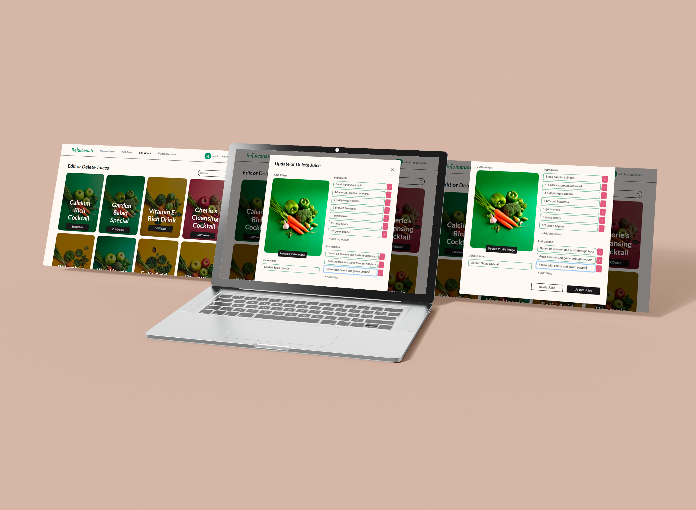

<!-- Repository Information & Links-->
<br />


<!-- HEADER SECTION -->
<h5 align="center" style="padding:0;margin:0;">Kayla Posthumus - 231096</h5>
<h6 align="center">DV200 Term 4</h6>
</br>
<p align="center">

  <a href="https://github.com/KaylaPosthumusOW/Rejuicenate.git">
    
  </a>
  
  <h3 align="center">Rejuicenate</h3>

  <p align="center">
     Revitalise Your Health<br>
      <a href="https://github.com/KaylaPosthumusOW/Rejuicenate"><strong>Explore the docs »</strong></a>
   <br />
   <br />
   <a href="path/to/demonstration/video">View Demo</a>
    ·
    <a href="https://github.com/KaylaPosthumusOW/Rejuicenate/issues">Report Bug</a>
    ·
    <a href="https://github.com/KaylaPosthumusOW/Rejuicenate/issues">Request Feature</a>
</p>
<!-- TABLE OF CONTENTS -->
## Table of Contents

- [Table of Contents](#table-of-contents)
- [About the Project](#about-the-project)
  - [Project Description](#project-description)
  - [Built With](#built-with)
- [Getting Started](#getting-started)
  - [Prerequisites](#prerequisites)
  - [How to install](#how-to-install)
  - [Installation](#installation)
- [Features and Functionality](#features-and-functionality)
  - [Feature 1](#feature-1)
  - [Feature 2](#feature-2)
  - [Feature 3 - Standard User](#feature-3---standard-user)
  - [Feature 4 - Admin User](#feature-5---admin-user)
- [Concept Process](#concept-process)
  - [Ideation](#ideation)
  - [Wireframes](#wireframes)
  - [User-flow](#user-flow)
- [Development Process](#development-process)
  - [Implementation Process](#implementation-process)
    - [Highlights](#highlights)
    - [Challenges](#challenges)
  - [Future Implementation](#future-implementation)
- [Final Outcome](#final-outcome)
  - [Mockups](#mockups)
  - [Video Demonstration](#video-demonstration)
- [Roadmap](#roadmap)
- [Contributing](#contributing)
- [Authors](#authors)
- [License](#license)
- [Contact](#contact)
- [Acknowledgements](#acknowledgements)

<!--PROJECT DESCRIPTION-->

## About the Project

<!-- header image of project -->


### Project Description

ReJuicenate is a web application designed to tackle the growing health crisis related to poor nutrition, which affects millions of individuals and contributes to chronic conditions such as asthma and heart disease. In our fast-paced society, many struggle to maintain a balanced diet, leading to significant quality-of-life issues and increased healthcare costs. By providing personalized juice fasting plans, nutritional guidance, and progress tracking, ReJuicenate empowers users to reclaim their health. This application not only helps individuals make informed dietary choices but also fosters a healthier community overall, reducing the burden of chronic health issues.

### Frontend
- [React.js](https://react.dev/) - JavaScript library for building user interfaces
- [React Router](https://reactrouter.com/) - Routing library for React applications
- [Axios](https://axios-http.com/) - HTTP client for making requests to the backend
- [React Bootstrap](https://react-bootstrap.github.io/) - Bootstrap components for React
- [Framer Motion](https://www.framer.com/motion/) - Animations and transitions library for React
- [React Hook Form](https://react-hook-form.com/) - Form handling library for React
- [React Modal](https://reactcommunity.org/react-modal/) - Accessible modal dialog component for React
- [React Confetti](https://www.npmjs.com/package/react-confetti) - Fun confetti animations for React

### Backend
- [Node.js](https://nodejs.org/) - JavaScript runtime for building the backend
- [Express.js](https://expressjs.com/) - Web framework for Node.js
- [MongoDB](https://www.mongodb.com/) - NoSQL database for storing application data
- [Mongoose](https://mongoosejs.com/) - MongoDB object modeling for Node.js
- [JWT](https://jwt.io/) - JSON Web Tokens for authentication
- [Bcrypt.js](https://www.npmjs.com/package/bcryptjs) - Password hashing for Node.js
- [CORS](https://www.npmjs.com/package/cors) - Middleware for enabling CORS in Express
- [Multer](https://www.npmjs.com/package/multer) - Middleware for handling file uploads
- [UUID](https://www.npmjs.com/package/uuid) - Library for generating unique IDs

### Other Tools
- [Font Awesome](https://fontawesome.com/) - Icon library for UI elements
- [Dotenv](https://www.npmjs.com/package/dotenv) - Environment variable management


## Getting Started

The following instructions will get you a copy of the project up and running on your local machine for development and testing purposes.

### Prerequisites

Ensure that you have the latest version of [Node.js](https://nodejs.org/) installed on your machine.

### How to install

### Installation

Here are the steps to clone this repo using GitHub Desktop and set up the project:

1. **Clone the Repository**:

   - Open GitHub Desktop.
   - Click on `File` -> `Clone repository...`.
   - In the `URL` tab, enter `https://github.com/KaylaPosthumusOW/Rejuicenate.git` and choose the local path where you want to save the repository.
   - Click `Clone`.

2. **Install Dependencies**:

   - Open your terminal or command prompt.
   - Navigate to the cloned repository directory.
   - Run the following command to install all required dependencies:
     ```sh
     npm install
     ```
  - Navigate to the backend folder of the repository and install the backend dependencies.
     ```sh
     cd rejuicenate
     cd backend
     npm install
     ```

3. **Set Up Environment Variables**:

   - Create a `.env` file in the `backend` directory.
   - Add the following environment variables to your `.env` file:

     ```sh
     PORT=5001
     MONGODB_URI=your_mongodb_connection_string
     JWT_SECRET=your_jwt_secret
     ```

     **Note**: Replace `your_mongodb_connection_string` and `your_jwt_secret` with your actual MongoDB URI and JWT secret key. Do not share these values publicly.

4. **Run the Backend Server**:

   - Ensure you are in the `backend` directory.
   - Run the following command to start the backend server:
     ```sh
     npm start
     ```

   - The backend server should now be running on `http://localhost:5001`.

5. **Run the Frontend Server**:

   - Open a new terminal window.
   - Navigate to the root directory of the cloned repository.
   - Run the following command to start the frontend server:
     ```sh
     npm start
     ```

   - The frontend server should now be running on `http://localhost:3000`.

6. **Access the Application**:

   - Open your web browser and go to `http://localhost:3000`.
   - You should see the sign up page of the Rejuicenate application.


By following these steps, you will have the Rejuicenate project up and running on your local machine with your API keys securely stored in the `.env` file. This ensures that your keys are not publicly displayed or included in your repository.

<!-- FEATURES AND FUNCTIONALITY-->
<!-- You can add the links to all of your imagery at the bottom of the file as references -->

## Features and Functionality
## Standard Users


### Sign Up and Login

New users can create an account by signing up with their email and password. Passwords are securely hashed using Bcrypt for safe storage. Registered users can log in to their accounts using email and password. Upon successful authentication, a JSON Web Token (JWT) is issued for secure session management.


### Gathering Personal Information

Users can input details about their health goals, motivations, and dietary preferences. This information helps the app to personalize recommendations and progress tracking.


### Homepage

User Greeting: Displays a personalized welcome message using the user’s name upon login.
Personal Data Retrieval: Fetches user-specific personal information from the server to tailor the experience.
Health Condition Filtering: Suggests juices based on the user’s health conditions fetched from their personal data.
Visual Progress Indicator: Provides a visual representation of progress using a progress bar that fills according to the user's input.


### Browse Juices

Allows users to browse a diverse collection of juices, promoting healthy choices. Users can filter juices by specific categories, enhancing the discoverability of juices that meet their preferences. Displays a limited number of juices per page (12 in this case), improving load times and user experience. When clicking on one of the juice cards it Fetches a specific juice's details and its associated reviews based on juiceId. Allows users to like or unlike a juice, updating the UI accordingly.
Maintains the state of whether the juice is liked and provides feedback through icons. The user is also able to add a review and see other users reviews of the juice.


### Tracking Progress

Displays user-specific personal data, including health goals and motivations, to motivate the user. Provides a user-friendly modal for users to input their tracking data, including day description, feelings, and modifications. Displays a circular progress tracker that visually represents the user’s progress towards their fasting goals. 


### Profile Page

Shows the user's name, surname, email, and profile image, providing a clear view of the user's account details. Allows users to update their profile information (name, surname, email) and profile image through a modal interface. The modal includes a preview of the new profile image before submission. Fetches and displays a list of juices that the user has liked, enhancing user engagement with personalized content.

## Admin User


### Add a new juice

This page allows the admins to dynamically add a new juice to the application. They are able to add multiple ingredients and instructions.



### Update or Delete Juice

The admin is also able to update and delete existing juices. The modal pre-fills with existing juice details, allowing for editing. The user can delete the juice, and the UI will update to reflect this change. The modal can be opened or closed based on user interaction, making the UI responsive and intuitive.


### Browse Juices

The admin is also able to browse the juices like a standard user to be able to determine if there is any update needed.


### Update and delete reviews

The admin is also able to see the flagged reviews. They can then approve the review or delete it.


### Admin profile

The admin is also able to update their profile and profile_image and log out.

<!-- CONCEPT PROCESS -->
<!-- Briefly explain your concept ideation process -->

## Concept Process

The `Conceptual Process` is the set of actions, activities and research that was done when starting this project.

### Ideation

For the ideation we designed a mood board and also determined our colour palette and typography


### Database


<!-- DEVELOPMENT PROCESS -->

---

## Development Process

The `Development Process` outlines the technical implementations and functionalities included in both the frontend and backend of the Exhibito application.

### Implementation Process

- **Functionality Implementations**:
  - Implemented user authentication and authorisation using `JWT` for secure access control.
  - Created CRUD operations for juices, reviews, trackeddata and likedJuices using `Express` and `MongoDB`.
  - Developed a responsive UI using `React` and `Bootstrap`.
  - Used `React Router` for seamless client-side routing.

- **Design Architecture**:
  - Followed `MVC` (Model-View-Controller) architecture for the backend to separate concerns.
  - Applied `MVVM` (Model-View-ViewModel) pattern in the frontend for clean separation of UI and business logic.

- **Plugins and Tools**:
  - Utilized `Mongoose` for MongoDB object modeling and schema validation.
  - Used `Axios` for making HTTP requests from the frontend to the backend.
  - Integrated `React-Bootstrap` for pre-styled components and better UI/UX consistency.

- **Frontend Functionalities**:
  - Developed user registration and login forms with validation.
  - Created dynamic juicess and juice recipe pages.
  - Implemented user profile pages showing liked juices and profile updates.
  - Built a user progress tracker.
  - Added filtering features for juices based on categories.
  - Created modals for the admin to add Juices and update or delete juices.

- **Backend Functionalities**:
  - Set up RESTful API endpoints for managing users, juices, likedJuices, trackeddata, personalInformation, categories, and reviews.
  - Implemented middleware for request validation and error handling.
  - Used environment variables for configuration settings and sensitive data management.
  - Implemented role-based access control to differentiate between standard users, and admins.


#### Highlights

- Witnessing the backend content seamlessly populate on the front end was immensely gratifying.
- Successfully implementing the dynamic progress tracker and seeing the circle fill with progress was incredibly rewarding.
- Bringing my UX project from Term 2 to life and deploying it was a fulfilling experience.
- Achieving full responsiveness for the project was a significant accomplishment.

#### Challenges

<!-- stipulated the challenges you faced with the project and why you think you faced it or how you think you'll solve it (if not solved) -->

- Managing asynchronous operations, such as API calls for retrieving details about juices and users, as well as implementing update functionality, was a struggle.
- Coordinating the deletion of juices along with their associated likedJuices and reviews was an essential aspect of the process.
- Ensuring that Rejuicenate remained responsive across various screen sizes was a challenging yet rewarding task that required considerable time and effort.
- Designing the progress tracker and implementing the animation for the filling circle added a dynamic element to the user experience.

### Future Implementation

<!-- stipulate functionality and improvements that can be implemented in the future. -->

- Adding more animations and interactivity.
- Flagging a review can be based on an integer value, so that multiple users' reviews results in its removal, and not only one person.
- Update the just fast duration.

<!-- MOCKUPS -->

## Final Outcome

### Mockups


<!-- VIDEO DEMONSTRATION -->

### Video Demonstration

To see a run through of the application, click below:

[View Demonstration](path/to/video/demonstration)

<!-- ROADMAP -->

## Roadmap

See the [open issues](https://github.com/KaylaPosthumusOW/Rejuicenate/issues) for a list of proposed features (and known issues).

<!-- CONTRIBUTING -->

## Contributing

Contributions are what makes the open-source community such an amazing place to learn, inspire, and create. Any contributions you make are **greatly appreciated**.

1. Fork the Project
2. Create your Feature Branch (`git checkout -b feature/AmazingFeature`)
3. Commit your Changes (`git commit -m 'Add some AmazingFeature'`)
4. Push to the Branch (`git push origin feature/AmazingFeature`)
5. Open a Pull Request

<!-- AUTHORS -->

## Authors

- **Kayla Posthumus** - [KaylaPosthumusOW](https://github.com/KaylaPosthumusOW)

<!-- LICENSE -->

## License

Distributed under the MIT License. See `LICENSE` for more information.\

<!-- LICENSE -->

## Contact

- **Kayla Posthumus** - [231096@virtualwindow.co.za](mailto:231096@virtualwindow.co.za)
- **Project Link** - https://github.com/KaylaPosthumusOW/Rejuicenate

<!-- ACKNOWLEDGEMENTS -->

## Term Deliverables

- **Open Brief Proposal** - [Open Brief Proposal](./README_mockups/DV200_T4_Proposal.pdf)
- **Milestone Check Document** - [Open Brief Proposal](./README_mockups/Kayla%20Posthumus_Progress%20Milestone%20Check_DV200.pdf)

<!-- all resources that you used and Acknowledgements here -->
